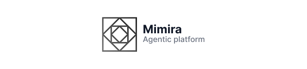

## Introduction

This repository contains code fot the Mimira Agentic Platform. Its written using Next.js, TypeScript and Tailwind CSS.

## How to setup

> Before you start, make sure you have Bun installed. Check the [Bun website](https://bun.sh/) for instructions.

1. Clone the repository
2. Run `bun install` to install the dependencies
3. Run `bun dev` to start the development server

## Getting Started

To run development server use:

```bash
bun dev
```

Open [http://localhost:3000](http://localhost:3000) with your browser to see the result.
